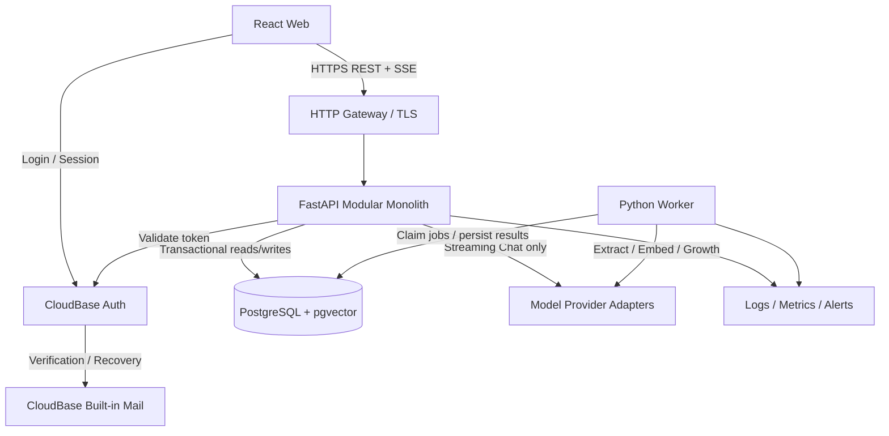
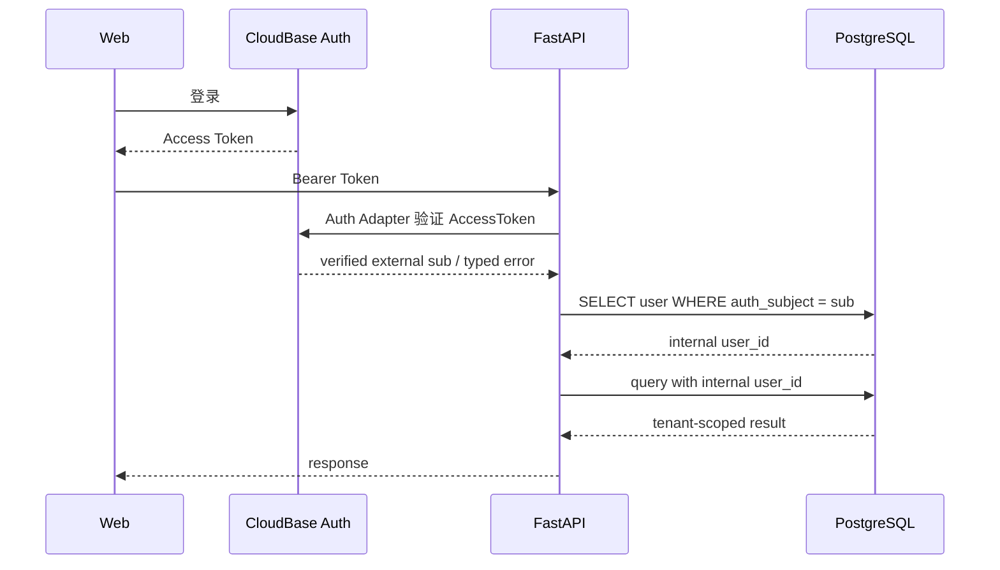
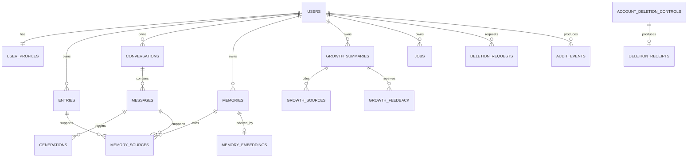
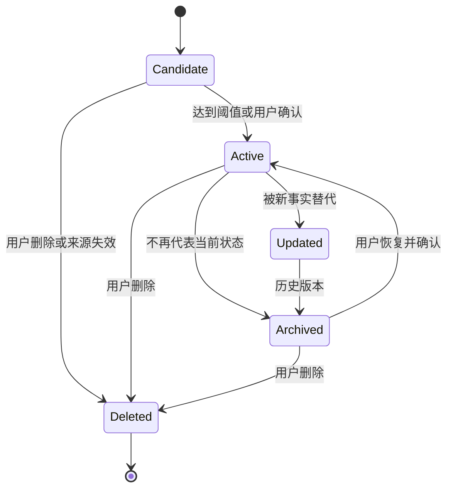
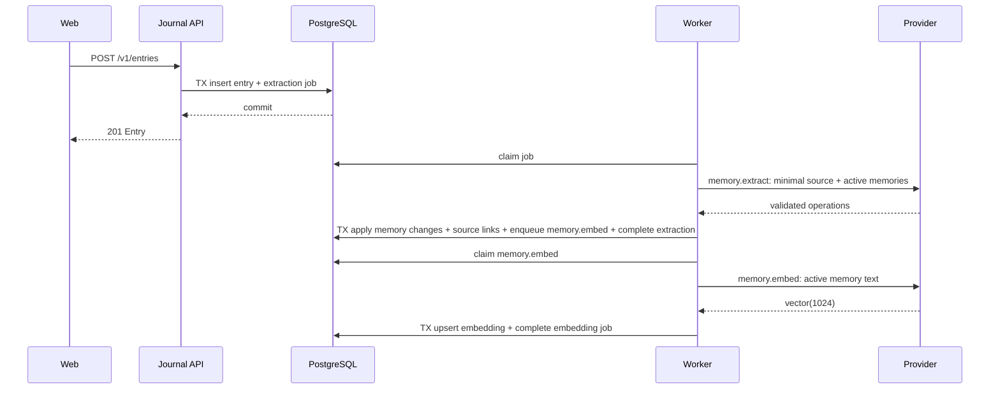
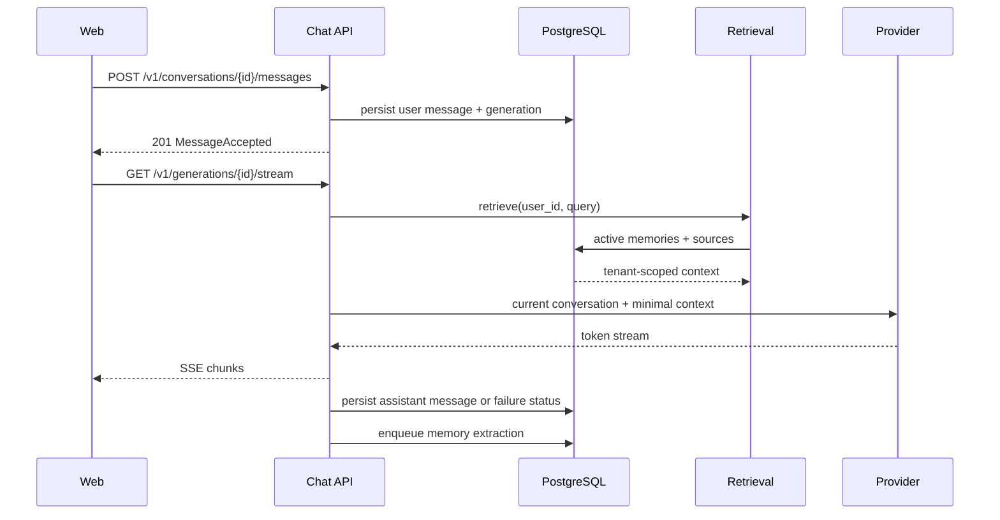
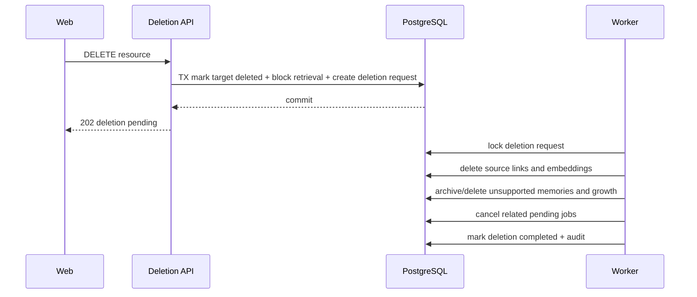
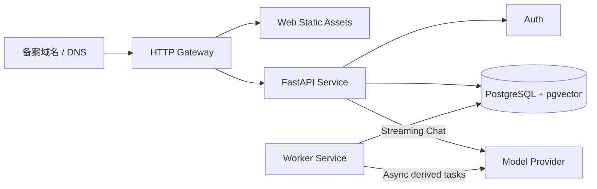

# Dayfold P2 Technical Specification

状态：Final v1.0 — Decision Frozen / Conditional P3 Entry
版本：v1.0
日期：2026-09-22
文档类型：HLD + 数据设计 + 接口设计 + 运行设计
目标读者：产品负责人、前后端工程、数据工程、QA、DevOps

冻结日期：2026-09-22
冻结范围：O-01 至 O-10
变更规则：任何影响身份、租户隔离、生产数据库、删除、备案、AI 合规、SLO 或恢复目标的修改必须新增 ADR，并重新执行生产就绪审查。

成熟度定义：

```text
Decision Frozen       已选择方向，变更必须新增 ADR
Implementation Ready  接口、状态和失败语义足够直接实现
Production Validated  已在生产等价环境形成验证证据
```

本文冻结 O-01 至 O-10 的决策，不把尚未执行的生产验证写成已完成。P3 先关闭 Auth Adapter 和数据库角色契约，再实现业务纵切；恢复演练与合规工作并行推进，在各自发布门禁前完成。`[Architecture decision]`

## 设计结论

Dayfold MVP 采用 React/Vite/TypeScript Web、FastAPI 模块化单体、PostgreSQL/pgvector 和独立 Python Worker。CloudBase 上海用于 Auth、API、Worker 和企业版独享 PostgreSQL；免费版和个人版共享数据库永久限定为 Preview/开发测试。`[Data-backed]`

PostgreSQL 是用户、原始记录、对话、Memory、来源关系、删除状态和任务状态的唯一业务事实来源。模型供应商只执行生成、Embedding 或提取，不保存 Dayfold 的权威状态。Dify 继续只处理虚构评测数据，不进入生产链路。`[Data-backed]`

所有业务访问必须同时满足已验证身份和内部 `user_id` 约束。跨用户读取、修改、删除或召回的允许值为零；前端传入的 `user_id` 永远不作为授权依据。`[Data-backed]`

P2 已冻结架构和契约。P3 可以初始化应用和 Staging Schema，但不能购买生产资源、创建 Production Schema、接入真实用户数据或切换正式 DNS。`[Data-backed]`

## 范围与依据

### 上游需求

| ID | 需求 | 来源 | 设计响应 |
|---|---|---|---|
| R-01 | 注册、登录、账户安全与数据隔离 | MVP 规格 | Auth Gateway、内部用户映射、租户约束 |
| R-02 | 日记创建、编辑、删除与历史 | MVP 规格 | Journal 模块、版本与删除传播 |
| R-03 | 多轮 AI 对话、流式回复、停止与重试 | MVP 规格 | Chat 模块、SSE、幂等消息 |
| R-04 | Event、Interest、Goal 三类 Memory | MVP 规格 | Memory 状态机与类型约束 |
| R-05 | 自动提取、Embedding 与向量检索 | MVP 规格 | Worker、Provider Adapter、pgvector |
| R-06 | Memory 查看、修改、删除、关闭与来源 | MVP 规格 | Memory API、来源关系、召回过滤 |
| R-07 | 基础 Growth 与证据来源 | MVP 规格 | Growth 派生数据与来源关系 |
| R-08 | 删除全部内容与账户注销 | MVP 规格 | Deletion Orchestrator、幂等清理任务 |
| R-09 | 失败不丢原始内容 | MVP 规格 | 原始写入与异步 AI 任务分离 |
| R-10 | 监控、限流、备份与恢复 | MVP 规格、PRR | 运行指标、告警、恢复演练 |
| R-11 | 中国大陆正式部署与备案 | P1 架构决策 | 上海单地域、Preview/Production 隔离 |
| R-12 | Dify 不接收真实私人数据 | P1 Dify Contract | 生产依赖图中排除 Dify |

以上需求均来自仓库现有规格和 P1 决策。`[Data-backed]`

### 本期不包含

- 完整 Timeline、复杂 Themes、周报和月报。`[Data-backed]`
- 主动陪伴、通知、PWA 和原生 App。`[Data-backed]`
- 图片、语音、视频、地点和链接记录。`[Data-backed]`
- 社区、积分、订阅、多 AI 角色和 Avatar。`[Data-backed]`
- 跨地域双活和多云热切换。`[Expert judgment]`
- 生产资源购买、ICP 提交和正式 DNS 切换。`[Data-backed]`

## 关键决策

| ID | 决策 | 理由 | 状态 |
|---|---|---|---|
| D-01 | 使用模块化单体，不拆微服务 | 单人开发、MVP 规模和一致性要求优先于独立扩缩容 | Accepted `[Expert judgment]` |
| D-02 | PostgreSQL 为唯一事实来源 | 原始内容、来源、状态和向量需要同事务边界 | Accepted `[Data-backed]` |
| D-03 | 派生 AI 工作异步化，流式 Chat 由 API 同步调用 Provider | 原始记录不能因模型失败丢失，而 SSE 需要请求生命周期内持续输出 | Accepted `[Data-backed]` |
| D-04 | 内部用户 ID 与 Auth `sub` 分离 | 避免业务主键绑定供应商身份格式 | Accepted `[Expert judgment]` |
| D-05 | 每个仓储方法显式接收 `user_id` | 让租户过滤成为接口契约而非调用约定 | Accepted `[Data-backed]` |
| D-06 | PostgreSQL RLS 作为第二道边界 | 防止应用层遗漏过滤导致跨用户访问 | Accepted `[Expert judgment]` |
| D-07 | 删除绕过 LLM | 删除必须确定、幂等、可审计 | Accepted `[Data-backed]` |
| D-08 | Memory 使用状态机，不覆盖历史记录 | 需要来源追溯、纠正和冲突归档 | Accepted `[Data-backed]` |
| D-09 | SSE 用于 Chat 流式输出 | 与 Web 单向增量响应需求匹配，复杂度低于 WebSocket | Accepted `[Expert judgment]` |
| D-10 | Dify 不进入生产链路 | Dify 仅是 P1 baseline，不能成为业务事实来源 | Accepted `[Data-backed]` |
| D-11 | Preview、Staging、Production 完全隔离 | 防止测试 Token、数据和 Secret 进入生产 | Accepted `[Data-backed]` |
| D-12 | CloudBase 上海为既定运行平台，Production 使用企业版独享数据库 | 人工工单确认共享实例无 SLA 且不适合生产核心业务 | Accepted `[Data-backed]` |

Production 启用 PostgreSQL RLS，并保留仓储层 `user_id` 强制约束、复合租户外键和双用户负向测试。API 与普通 Worker 连接角色不得拥有 `BYPASSRLS`；受限的非登录函数 Owner 和备份运维角色单独审计。`[Expert judgment]`

## 系统架构



图 1：Dayfold MVP 逻辑架构。Web 不直接访问业务数据库；FastAPI 处理同步命令、查询和流式 Chat，Worker 处理 Memory、Embedding 与 Growth 等派生任务。Chat 是 D-03 的唯一同步 Provider 调用例外，API 与 Worker 都只能通过 Provider Adapter 使用模型凭据。Auth 只证明外部身份，内部用户与业务授权由 Dayfold 管理。`[Expert judgment]`

### 组件边界

| 组件 | 单一责任 | 输入 | 输出 | 不负责 |
|---|---|---|---|---|
| Web | 呈现页面和发起用户操作 | 用户输入、API 响应、Auth 状态 | REST/SSE 请求、可见状态 | 业务授权、事实存储 |
| Auth Gateway | 把外部 Token 解析为内部用户上下文 | Bearer Token | `AuthContext` | 业务资料、Memory |
| Journal | 管理原始日记生命周期 | 用户命令 | Entry、领域事件 | 模型提取 |
| Chat | 管理会话、Generation 和流式 Provider 调用 | 用户消息 | 持久化消息、SSE 输出 | 长期 Memory 真值 |
| Memory | 管理 Memory 状态与来源 | 用户命令、提取候选 | Memory 视图、召回候选 | 原始内容修改 |
| Retrieval | 在租户边界内选择上下文 | 查询文本、用户 ID | 少量来源可追溯上下文 | 修改 Memory |
| Growth | 生成有来源的基础回顾 | 用户 ID、时间范围 | Growth Summary | 无证据推断 |
| Jobs | 管理异步任务状态和幂等 | 领域事件 | 可领取任务、重试状态 | 业务结果真值 |
| Worker | 执行异步派生任务 | Jobs | Memory、Embedding、Growth | Chat SSE、HTTP 用户会话 |
| Provider Adapter | 隔离模型协议 | 最小必要上下文 | 标准化模型结果 | 保存业务状态 |
| Deletion Orchestrator | 管理确定性删除传播 | 删除请求 | 删除状态、审计事件 | 调用 LLM 判断删除 |

依赖方向为 `Web → API modules → repositories → PostgreSQL`，Worker 只通过 Jobs 和仓储访问业务状态。模块之间不得反向导入 Web、部署或供应商 SDK。`[Expert judgment]`

## 身份与租户隔离

### 身份映射



图 2：身份与内部用户映射。Production 使用 CloudBase Auth v2 邮箱注册、邮箱验证和邮箱密码登录；用户名密码测试用户只保留在 Preview。AccessToken 校验发生在请求进入业务模块之前；业务模块只能看到内部 `user_id`，不能使用前端提交的用户标识。`[Expert judgment]`

### 生产 Auth 策略

1. 注册使用邮箱、密码和邮箱验证码，登录使用邮箱密码；找回密码通过邮箱验证完成。`[Research-backed]`
2. MVP 使用 CloudBase 内置邮件代发，不配置第三方 SMTP；发送效果、垃圾邮件率或品牌发件人不能达标时，再通过 ADR 切换自定义 SMTP。`[Research-backed]`
3. Web 由 CloudBase Auth SDK 管理 AccessToken 和 RefreshToken；AccessToken 默认有效期为 2 小时。`[Research-backed]`
4. FastAPI 通过 `CloudBaseAuthAdapter.verify_access_token()` 调用 CloudBase 支持的服务端验证路径，不在业务模块内解析未验证声明，也不依赖未承诺的 JWKS 结构。`[Expert judgment]`
5. Auth Adapter 返回稳定的 CloudBase 用户标识，再映射为 Dayfold 内部 UUID。Token 原文不得写入日志、数据库或错误响应。`[Expert judgment]`
6. CloudBase 未提供可作为 Dayfold 承诺依据的独立 Auth SLA；Production 通过合成登录监控、注册关闭开关和已登录用户只读降级控制风险。`[Data-backed]`
7. 账户删除按“内部用户立即进入 `deletion_pending` 并拒绝业务访问 → 禁用 Auth 身份 → 确认 `BLOCKED` → 清理业务数据 → 删除 Auth 身份”执行。客户端清除当前会话是辅助动作，不作为服务端安全门禁。该顺序必须用虚构账号通过 E2E 测试。`[Architecture decision]`

Auth Adapter 契约：

```text
verify_access_token(token)
  -> VerifiedIdentity(auth_subject, email)
  -> INVALID_TOKEN | TOKEN_EXPIRED | AUTH_PROVIDER_UNAVAILABLE

disable_identity(auth_subject)
  -> completed | already_disabled | retryable_failure

delete_identity(auth_subject)
  -> completed | already_deleted | retryable_failure
```

所有调用超时 3 秒；验证调用只对网络故障重试 1 次，禁用和删除由账户删除控制面持续重试，不进入普通 `jobs`。Provider 凭据只授予身份验证和用户管理所需的最小权限。P3-Auth-01 已锁定 Token 验证为 CloudBase `/auth/v2/user/me`，禁用和恢复为 `ModifyUser(UserStatus=BLOCKED|ACTIVE)`，删除为 `DeleteUsers(Uids)`。`/auth/v1/user/revoke/all` 没有 UID 参数，只用于当前用户自助撤销；MVP 使用内部状态门禁和身份冻结作为补偿控制。验证证据见 `docs/p3/p3-auth-01-server-validation-result.md`，决策见 `docs/adr/2026-09-22-cloudbase-session-revocation-compensation.md`。`[Architecture decision]`

CloudBase 不可用时，新登录和 Token 刷新失败；已有请求不得使用缓存身份绕过 Token 过期。应用可以进入只读维护页，但不得继续接受私人内容写入。`[Architecture decision]`

官方依据：

- https://docs.cloudbase.net/authentication-v2/method/signup
- https://docs.cloudbase.net/authentication-v2/method/email-login
- https://docs.cloudbase.net/api-reference/webv2/authentication
- https://docs.cloudbase.net/http-api/basic/access-token

### AuthContext

```text
AuthContext
  user_id: UUID
  auth_subject: string
  session_id: string | null
  issued_at: datetime
```

`auth_subject` 在 `users` 表中唯一；业务表只引用内部 UUID。Token 原文不写入日志或数据库。`[Expert judgment]`

### 强制规则

1. 除公开页面和 `/health` 外，所有 API 必须认证。`[Data-backed]`
2. 每个租户表包含 `user_id NOT NULL`。`[Data-backed]`
3. 每个 Repository 公共方法必须显式接收 `user_id`。`[Expert judgment]`
4. 对象读取使用 `WHERE id = :id AND user_id = :user_id`，不存在与无权访问统一返回 `404 RESOURCE_NOT_FOUND`。`[Expert judgment]`
5. 关联表使用 `(resource_id, user_id)` 复合外键，防止跨租户来源关系。`[Expert judgment]`
6. 后台任务载荷包含 `user_id`，执行前重新验证目标资源归属。`[Expert judgment]`
7. 管理员和普通业务连接不得默认绕过 RLS。`[Expert judgment]`

## 数据设计

### 实体关系



图 3：核心数据关系。Memory 可以引用日记或消息；来源删除后，相关 Memory 进入重新评估或删除流程。Embedding 与 Memory 分表，便于模型迁移和索引重建而不改变 Memory 真值。`[Expert judgment]`

### 表级摘要

| 表 | 关键字段 | 约束与用途 |
|---|---|---|
| `users` | `id`, `auth_subject`, `status`, `created_at`, `deleted_at` | `auth_subject` 唯一；业务身份根 |
| `user_profiles` | `user_id`, `display_name`, `bio`, `updated_at` | 用户主动填写的基础资料 |
| `user_settings` | `user_id`, `memory_enabled`, `ai_enabled`, `locale` | 与用户一对一 |
| `entries` | `id`, `user_id`, `content`, `occurred_at`, `version`, `deleted_at` | 原始日记；乐观锁 |
| `conversations` | `id`, `user_id`, `title`, `created_at`, `deleted_at` | 对话容器 |
| `messages` | `id`, `user_id`, `conversation_id`, `role`, `content`, `client_request_id`, `status` | `client_request_id` 用户内唯一 |
| `generations` | `id`, `user_id`, `conversation_id`, `user_message_id`, `assistant_message_id`, `attempt`, `status`, `provider_request_id`, `started_at`, `completed_at` | 一个用户消息可以有多个生成尝试 |
| `memories` | `id`, `user_id`, `type`, `content`, `confidence`, `status`, `superseded_by`, `deleted_at` | Event/Interest/Goal 状态机 |
| `memory_sources` | `memory_id`, `user_id`, `entry_id`, `message_id` | Entry/Message 二选一；复合租户外键 |
| `memory_embeddings` | `memory_id`, `user_id`, `schema_version`, `model`, `dimensions`, `embedding`, `updated_at` | v1 使用 `doubao-embedding-vision-251215`、1024 维 |
| `growth_summaries` | `id`, `user_id`, `period_start`, `period_end`, `content`, `status` | 只保存有证据的回顾 |
| `growth_sources` | `growth_id`, `user_id`, `entry_id`, `message_id`, `memory_id` | 证据来源 |
| `growth_feedback` | `id`, `user_id`, `growth_id`, `reason`, `created_at` | MVP 只支持 `inaccurate` |
| `jobs` | `id`, `user_id`, `kind`, `payload_ref`, `status`, `attempts`, `available_at`, `dedupe_key` | 数据库任务队列 |
| `deletion_requests` | `id`, `user_id`, `scope`, `target_id`, `status`, `requested_at`, `completed_at` | 删除编排与恢复 |
| `audit_events` | `id`, `user_id`, `action`, `resource_type`, `resource_id`, `result`, `created_at` | 不记录完整私人内容 |
| `account_deletion_controls` | `id`, `receipt_id`, `target_user_id`, `idempotency_key`, `request_hash`, `auth_subject_ciphertext`, `email_ciphertext`, `state`, `claim_token_hash`, `lease_expires_at`, `attempts`, `next_attempt_at`, `created_at` | `target_user_id` 无外键；账户删除的独立控制面队列 |
| `deletion_receipts` | `id`, `receipt_secret_hash`, `scope`, `status`, `requested_at`, `completed_at`, `expires_at` | 无用户外键；A-04 事务中创建，保留 30 天 |

字段类型、长度、索引名称和 DDL 在 P3 数据库实现计划中定义；表、关系和关键约束在本规格评审后冻结。`[Expert judgment]`

Embedding Schema v1 固定为 `vector(1024)`、模型 `doubao-embedding-vision-251215`、cosine 距离和 HNSW 索引。模型切换必须写入新的 `schema_version`，在并行表或分区完成全量重建和质量验证后原子切换读取版本；不得在同一索引中混用维度。维度不匹配的任务进入 `failed_terminal` 并触发告警。`[Data-backed]`

### Memory 状态机



图 4：Memory 状态机。`Deleted` 为终态；新事实通过新记录和 `superseded_by` 关联旧记录，不原地覆盖历史。只有 `Active` 进入默认召回，用户确认的恢复操作是例外。`[Data-backed]`

### 索引

| 数据 | 索引 | 理由 |
|---|---|---|
| 所有租户表 | `(user_id, id)` | 所有对象访问先按租户收窄 |
| Entries | `(user_id, occurred_at DESC)` | Today 历史 |
| Messages | `(user_id, conversation_id, created_at)` | 会话顺序 |
| Memories | `(user_id, status, updated_at DESC)` | Memory 列表与召回前过滤 |
| Jobs | `(status, available_at)` | Worker 领取任务 |
| Jobs | `(user_id, dedupe_key)` unique | 幂等任务 |
| Embeddings | HNSW + cosine | 默认参数 `m=16`、`ef_construction=64`、`ef_search=40` |

向量查询必须先把候选限制在当前 `user_id` 和 `Active` 状态。Production 默认使用 HNSW；只有合成数据基准触发 O-03 变更条件时，才能通过 ADR 改用 IVFFlat。`[Expert judgment]`

## 核心流程

### 保存日记与异步提取



图 5：日记保存先提交原始内容和提取任务，再调用模型。`memory.extract` 在同一事务内保存 Memory、来源并创建 `memory.embed`；Embedding 由独立任务执行。任一任务失败只影响派生结果，不回滚已经保存的日记。任务通过 `dedupe_key` 避免同一版本重复处理。`[Data-backed]`

### Chat 流式回复



图 6：Chat 的用户消息和 Generation 在 Provider 调用前持久化。创建接口返回标识，流接口负责 SSE；停止生成只终止当前模型输出，不删除用户消息。`[Data-backed]`

用户消息幂等与生成尝试分离：

1. `(user_id, client_request_id)` 唯一标识一次用户消息提交；相同键和相同正文返回已存在的 `user_message_id`，相同键但正文不同返回 `409 DUPLICATE_REQUEST`。
2. 第一次调用创建 `generation.attempt = 1`。Provider 失败后的显式重试调用 A-27，复用用户消息并创建新的 Generation，`attempt` 递增。
3. 每个 Generation 状态只能按 `pending → streaming → completed | failed | cancelled` 转换。
4. A-13 的网络重放使用相同 `client_request_id`，返回原 `MessageAccepted` 和原 Generation，不创建新尝试。
5. `generation_id` 在 Provider 调用前持久化；A-26 建立 SSE 后先发送 `message.start`。
6. SSE 建立前的认证、限流和资源错误使用 JSON HTTP 错误；建立后的 Provider 错误使用 `message.error`。
7. SSE 断开只取消当前 Generation；客户端通过 A-21 读取终态，不续传已经丢失的 Token 流。
8. `stop` 对 `completed`、`failed`、`cancelled` 返回已有终态；对 `pending` 或 `streaming` 请求 Provider 取消并写入 `cancelled`。

以上规则避免把“消息只保存一次”和“生成可以重试”压缩为同一个幂等键。`[Architecture decision]`

### 删除传播



图 7：删除在同步事务内立即退出读取和召回，物理清理由 Worker 幂等完成。删除任务不调用 LLM；重试不会恢复已经删除的状态。`[Data-backed]`

账户注销使用独立控制流程：

1. Web 在首次发送前生成并可靠保存至少 256 bit 的 Receipt Secret 和 `Idempotency-Key`。请求事务创建无外键的 `account_deletion_controls` 和 `deletion_receipts`，保存 `target_user_id`、幂等键、规范请求 Hash、加密 Auth Subject 与通知邮箱，并且只保存 Receipt Secret Hash；初始状态为 `awaiting_confirmation`，此时账户仍可正常使用。
2. 同一用户、相同 `Idempotency-Key`、相同请求 Hash 和相同 Secret Hash 的重放返回原 `receipt_id`；同 Key 不同内容返回 `409 IDEMPOTENCY_CONFLICT`；不同 Key 遇到活动注销返回 `409 DELETION_EXISTS`。
3. Web 收到 A-04 响应并保存 `receipt_id` 后调用 A-29。确认事务把 `users.status` 设为 `deletion_pending`，控制状态改为 `access_denied`；此后所有业务请求和模型任务立即拒绝。
4. 独立账户删除 Worker 先调用 `ModifyUser(UserStatus=BLOCKED)` 并确认身份已冻结，再物理删除租户业务表、`users` 和带 `user_id` 的审计事件。
5. Worker 从 `account_deletion_controls` 领取任务，不使用租户 `jobs`；按 `access_denied → identity_disabled → business_deleted → identity_deleted → notification_sent → completed` 推进，每一步幂等。失败时保留当前阶段并持续重试，30 分钟后告警并进入人工升级。
6. 每个状态变化同步更新 `deletion_receipts.status`。删除成功后发送通知邮件，随即销毁加密的 Auth Subject 和邮箱，只保留 30 天的非内容型回执。
7. 确认事务提交后，用户使用回执 ID 和 `X-Deletion-Receipt` Secret 查询状态；服务端只保存 Secret Hash。
8. 活动回执的 `expires_at` 为 `null`，不得过期。进入 `completed` 时在同一事务设置 `completed_at = now()` 和 `expires_at = completed_at + 30 天`；到期后物理删除。不存在、Secret 错误和已过期统一返回 `401 INVALID_RECEIPT`。
9. 客户端在首次发送前持久保存幂等键和 Receipt Secret，在 A-04 成功后补充保存 `receipt_id`；收到 `completed` 或回执失效后清除本地材料。

该顺序保证业务访问先停止，同时为 Auth 清理重试保留最小控制状态。`[Architecture decision]`

## API 契约

### 通用约定

基础路径为 `/v1`。除 `/health`、公开法律页面和 A-28 删除回执查询外，所有接口使用 Bearer Token。A-28 先由 Receipt Secret 中间件验证 `X-Deletion-Receipt`，不得进入普通 Auth Gateway；验证失败统一返回 `401 INVALID_RECEIPT`，不披露回执是否存在。响应使用 JSON；Chat 流式响应使用 `text/event-stream`。`[Expert judgment]`

成功响应中的时间均使用 ISO 8601 UTC。资源 ID 使用服务端生成 UUID。请求体不接受 `user_id`。`[Expert judgment]`

错误响应：

```json
{
  "error": {
    "code": "RESOURCE_NOT_FOUND",
    "message": "Resource was not found.",
    "request_id": "opaque-request-id"
  }
}
```

生产错误信息不得包含 SQL、Token、模型请求正文或其他用户数据。`[Expert judgment]`

### 接口清单

| ID | Method / Path | Auth | Request | Success | Errors | Idempotency |
|---|---|---|---|---|---|---|
| A-01 | `GET /health` | Public | 无 | `200 {status, service, environment, version}` | `503 SERVICE_UNAVAILABLE` | 不适用 |
| A-02 | `GET /v1/me` | Bearer | 无 | `200 UserView` | `401 INVALID_TOKEN` | 读取幂等 |
| A-03 | `PATCH /v1/me/settings` | Bearer | `UserSettingsPatch` | `200 UserSettings` | `400 INVALID_INPUT`, `401 INVALID_TOKEN` | 最终值幂等 |
| A-04 | `POST /v1/account/deletion-requests` | Bearer | `AccountDeletionRequest`, `Idempotency-Key` | `202 AccountDeletionAccepted` | `401 INVALID_TOKEN`, `409 IDEMPOTENCY_CONFLICT`, `409 DELETION_EXISTS` | `Idempotency-Key` + 每用户单活请求 |
| A-05 | `POST /v1/entries` | Bearer | `EntryCreate` | `201 EntryView` | `400 INVALID_INPUT`, `413 CONTENT_TOO_LARGE` | `Idempotency-Key` |
| A-06 | `GET /v1/entries` | Bearer | `cursor`, `limit` | `200 EntryPage` | `400 INVALID_CURSOR` | 读取幂等 |
| A-07 | `GET /v1/entries/{entry_id}` | Bearer | path UUID | `200 EntryView` | `404 RESOURCE_NOT_FOUND` | 读取幂等 |
| A-08 | `PATCH /v1/entries/{entry_id}` | Bearer | `EntryPatch`, `If-Match` | `200 EntryView` | `404 RESOURCE_NOT_FOUND`, `409 VERSION_CONFLICT` | 按版本幂等 |
| A-09 | `DELETE /v1/entries/{entry_id}` | Bearer | path UUID | `202 DeletionStatus` | `404 RESOURCE_NOT_FOUND` | 重复删除返回当前状态 |
| A-10 | `POST /v1/conversations` | Bearer | `ConversationCreate` | `201 ConversationView` | `400 INVALID_INPUT` | `Idempotency-Key` |
| A-11 | `GET /v1/conversations` | Bearer | `PageQuery` | `200 ConversationPage` | `400 INVALID_CURSOR` | 读取幂等 |
| A-12 | `GET /v1/conversations/{conversation_id}` | Bearer | path UUID | `200 ConversationDetail` | `404 RESOURCE_NOT_FOUND` | 读取幂等 |
| A-13 | `POST /v1/conversations/{conversation_id}/messages` | Bearer | `MessageCreate` | `201 MessageAccepted` | `404 RESOURCE_NOT_FOUND`, `409 DUPLICATE_REQUEST`, `429 RATE_LIMITED` | `client_request_id` |
| A-14 | `POST /v1/generations/{generation_id}/stop` | Bearer | path UUID | `202 GenerationStatus` | `404 RESOURCE_NOT_FOUND` | 重复停止幂等 |
| A-15 | `GET /v1/memories` | Bearer | `MemoryPageQuery` | `200 MemoryPage` | `400 INVALID_INPUT`, `400 INVALID_CURSOR` | 读取幂等 |
| A-16 | `GET /v1/memories/{memory_id}` | Bearer | path UUID | `200 MemoryDetail` | `404 RESOURCE_NOT_FOUND` | 读取幂等 |
| A-17 | `PATCH /v1/memories/{memory_id}` | Bearer | `MemoryPatch`, `If-Match` | `200 MemoryDetail` | `404 RESOURCE_NOT_FOUND`, `409 VERSION_CONFLICT` | 按版本幂等 |
| A-18 | `DELETE /v1/memories/{memory_id}` | Bearer | path UUID | `202 DeletionStatus` | `404 RESOURCE_NOT_FOUND` | 重复删除返回当前状态 |
| A-19 | `GET /v1/growth/current` | Bearer | 无 | `200 GrowthView` 或 `204` | `401 INVALID_TOKEN` | 读取幂等 |
| A-20 | `GET /v1/deletion-requests/{id}` | Bearer | path UUID | `200 DeletionStatus` | `404 RESOURCE_NOT_FOUND` | 读取幂等 |
| A-21 | `GET /v1/generations/{generation_id}` | Bearer | path UUID | `200 GenerationStatus` | `404 RESOURCE_NOT_FOUND` | 读取幂等 |
| A-22 | `POST /v1/memory-deletion-requests` | Bearer | `BulkDeletionRequest` | `202 DeletionStatus` | `409 DELETION_EXISTS` | 每作用域单活请求 |
| A-23 | `POST /v1/content-deletion-requests` | Bearer | `BulkDeletionRequest` | `202 DeletionStatus` | `409 DELETION_EXISTS` | 每作用域单活请求 |
| A-24 | `POST /v1/growth/{growth_id}/feedback` | Bearer | `GrowthFeedbackCreate` | `202 GrowthView` | `404 RESOURCE_NOT_FOUND`, `409 FEEDBACK_EXISTS` | 每 Growth 单一有效反馈 |
| A-25 | `PATCH /v1/me/profile` | Bearer | `UserProfilePatch` | `200 UserProfile` | `400 INVALID_INPUT` | 最终值幂等 |
| A-26 | `GET /v1/generations/{generation_id}/stream` | Bearer | path UUID | `200 SSE stream` | `404 RESOURCE_NOT_FOUND`, `409 GENERATION_TERMINAL`, `503 PROVIDER_UNAVAILABLE` | 每 Generation 一个活动流 |
| A-27 | `POST /v1/generations/{generation_id}/retries` | Bearer | `Idempotency-Key` | `201 GenerationStatus` | `404 RESOURCE_NOT_FOUND`, `409 GENERATION_ACTIVE`, `429 RATE_LIMITED` | `Idempotency-Key` |
| A-28 | `GET /v1/public/deletion-receipts/{receipt_id}` | Receipt Secret | `X-Deletion-Receipt` header | `200 DeletionReceiptView` | `401 INVALID_RECEIPT` | 读取幂等 |
| A-29 | `POST /v1/account/deletion-requests/{receipt_id}/confirm` | Bearer + Receipt Secret | `X-Deletion-Receipt` header | `202 DeletionStatus` | `401 INVALID_TOKEN`, `401 INVALID_RECEIPT`, `409 INVALID_DELETION_STATE` | 重复确认返回当前状态 |

HTTP 状态码后的业务错误码是接口契约的一部分；实现不得把所有失败折叠为 `500`。`[Expert judgment]`

### 请求与响应结构

```text
UserView
  id: UUID
  status: active | deletion_pending
  settings: UserSettings
  created_at: datetime

UserSettingsPatch
  memory_enabled: boolean, optional
  ai_enabled: boolean, optional
  locale: string, optional

UserSettings
  memory_enabled: boolean
  ai_enabled: boolean
  locale: string

UserProfilePatch
  display_name: string | null, optional, max 80
  bio: string | null, optional, max 500

UserProfile
  display_name: string | null
  bio: string | null
  updated_at: datetime

AccountDeletionRequest
  confirmation: string, required, exact value defined by Web confirmation flow
  receipt_secret: string, required, client-generated, at least 256 bit entropy

AccountDeletionAccepted
  deletion: DeletionStatus

BulkDeletionRequest
  confirmation: string, required

EntryCreate
  content: string, required, trimmed, non-empty
  occurred_at: datetime | null

EntryPatch
  content: string, optional, trimmed, non-empty
  occurred_at: datetime | null, optional

EntryView
  id: UUID
  content: string
  occurred_at: datetime
  version: integer
  created_at: datetime
  updated_at: datetime

PageQuery
  cursor: opaque string | null
  limit: integer, optional, bounded

EntryPage
  items: EntryView[]
  next_cursor: opaque string | null

ConversationCreate
  title: string | null

ConversationView
  id: UUID
  title: string | null
  created_at: datetime
  updated_at: datetime

ConversationPage
  items: ConversationView[]
  next_cursor: opaque string | null

ConversationDetail
  conversation: ConversationView
  messages: MessageView[]
  next_cursor: opaque string | null

MessageCreate
  content: string, required, trimmed, non-empty
  client_request_id: string, required

MessageView
  id: UUID
  role: user | assistant
  content: string
  status: completed | failed | cancelled
  created_at: datetime

MessageAccepted
  user_message_id: UUID
  generation_id: UUID
  generation_status: pending

MemoryPageQuery
  type: event | interest | goal | null
  status: candidate | active | updated | archived | null
  cursor: opaque string | null
  limit: integer, optional, bounded

MemoryPatch
  content: string, optional
  status: active | archived, optional

MemoryDetail
  id: UUID
  type: event | interest | goal
  content: string
  confidence: number
  status: candidate | active | updated | archived
  version: integer
  sources: SourceView[]
  created_at: datetime
  updated_at: datetime

MemoryPage
  items: MemoryDetail[]
  next_cursor: opaque string | null

SourceView
  source_type: entry | message | memory
  source_id: UUID
  excerpt: string
  source_at: datetime

GrowthView
  id: UUID
  period_start: date
  period_end: date
  content: string
  sources: SourceView[]
  generated_at: datetime

GrowthFeedbackCreate
  reason: inaccurate

GenerationStatus
  id: UUID
  user_message_id: UUID
  assistant_message_id: UUID | null
  attempt: integer
  status: pending | streaming | completed | failed | cancelled
  error_code: string | null
  started_at: datetime | null
  completed_at: datetime | null

DeletionStatus
  id: UUID
  scope: entry | memory | all_memories | all_content | account
  status: awaiting_confirmation | pending | running | retry_wait | completed
  requested_at: datetime
  completed_at: datetime | null

DeletionReceiptView
  id: UUID
  status: awaiting_confirmation | pending | running | retry_wait | completed
  requested_at: datetime
  completed_at: datetime | null
  expires_at: datetime | null
```

A-04 不创建租户级 `deletion_requests` 行。`AccountDeletionAccepted.deletion.id` 等于 `deletion_receipts.id`；Entry、Memory、全部 Memory 和全部内容删除才使用 `deletion_requests`。控制状态映射固定为：

```text
awaiting_confirmation                 -> awaiting_confirmation
access_denied                         -> pending
identity_disabled ... notification_sent -> running
当前阶段失败并等待 next_attempt_at       -> retry_wait
completed                             -> completed
```

`retry_wait` 重试成功后回到对应内部阶段，并对外恢复为 `running`。`[Architecture decision]`

MVP 输入和分页限制冻结如下：Entry 正文最多 20,000 个 Unicode code point，Chat 用户消息最多 8,000，Memory 正文最多 1,000，会话标题最多 80；分页默认 20 条、最大 50 条。超过限制返回 `413 CONTENT_TOO_LARGE` 或 `400 INVALID_INPUT`。`[Expert judgment]`

### 错误码

| HTTP | Code | 含义 | 客户端处理 |
|---:|---|---|---|
| 400 | `INVALID_INPUT` | 字段、过滤器或状态转换无效 | 修正请求 |
| 400 | `INVALID_CURSOR` | 分页游标无效或过期 | 从第一页重试 |
| 401 | `INVALID_TOKEN` | Token 缺失、过期或校验失败 | 重新认证 |
| 401 | `INVALID_RECEIPT` | 删除回执 Secret 无效 | 不披露请求是否存在 |
| 404 | `RESOURCE_NOT_FOUND` | 资源不存在或不属于当前用户 | 不区分原因 |
| 409 | `VERSION_CONFLICT` | 乐观锁版本冲突 | 刷新后重试 |
| 409 | `DUPLICATE_REQUEST` | 重复 `client_request_id` 且请求不一致 | 使用原请求结果 |
| 409 | `IDEMPOTENCY_CONFLICT` | 同一幂等键携带不同规范请求或 Secret Hash | 停止请求并提示用户 |
| 409 | `DELETION_EXISTS` | 当前用户在同一删除作用域已有活动请求 | 读取现有状态 |
| 409 | `INVALID_DELETION_STATE` | 删除请求当前阶段不允许该转换 | 读取当前状态 |
| 409 | `FEEDBACK_EXISTS` | Growth 已有有效反馈 | 返回当前反馈结果 |
| 409 | `GENERATION_ACTIVE` | 原 Generation 仍在执行 | 使用现有 Generation |
| 409 | `GENERATION_TERMINAL` | 终态 Generation 不可重新建立 Token 流 | 读取终态或调用重试接口 |
| 413 | `CONTENT_TOO_LARGE` | 内容超过已配置上限 | 缩短内容 |
| 429 | `RATE_LIMITED` | 请求超过用户或 Provider 限额 | 按 `Retry-After` 重试 |
| 503 | `PROVIDER_UNAVAILABLE` | 模型服务暂不可用 | 保留原始内容并允许重试 |
| 503 | `SERVICE_UNAVAILABLE` | 服务尚未就绪 | 稍后重试 |

所有错误都返回通用错误响应；同一 `code` 在所有接口中保持相同语义。`[Expert judgment]`

Memory 总开关关闭后，现有 Memory 保留但立即退出召回，待处理的 `memory.extract` 和 `memory.embed` 任务取消，新内容不创建 Memory 任务；重新开启后只处理开启后的新内容，不自动回扫历史。`POST /v1/memory-deletion-requests` 物理删除全部 Memory、Embedding、来源和相关 Growth 派生内容，但保留 Journal、Chat 和账户。`[Architecture decision]`

`BulkDeletionRequest` 不接受 `scope`；作用域由路径唯一决定。`POST /v1/content-deletion-requests` 删除全部 Journal、Chat、Memory、Growth 和派生任务，但保留账户、资料与设置。账户注销使用 A-04，覆盖全部内容、账户资料和 Auth 身份。三个操作不可互相替代。`[Architecture decision]`

用户编辑 Memory 时只使用 `If-Match` 作为版本前置条件，不在请求体重复提交版本。任意未删除 Memory 被用户修改后生成新版本并进入 `active`；旧版本进入 `updated`，自动任务不能覆盖用户确认版本。API、数据库和 Provider JSON 一律使用小写枚举。`[Architecture decision]`

### SSE 事件

```text
event: message.start
data: {"generation_id":"...","message_id":"..."}

event: message.delta
data: {"text":"..."}

event: message.complete
data: {"message_id":"...","finish_reason":"stop"}

event: message.error
data: {"code":"PROVIDER_UNAVAILABLE","retryable":true}
```

客户端断开后，服务端应取消未完成的 Provider 请求；已经持久化的用户消息保留，Assistant 消息记录 `failed` 或 `cancelled`。`[Expert judgment]`

## Worker 与任务契约

### 任务类型

| Kind | 触发 | 输入引用 | 输出 | 重试 |
|---|---|---|---|---|
| `memory.extract` | Entry/Message 创建或修改 | source ID + version | Memory operations | 可重试 |
| `memory.embed` | Active Memory 新增或修改 | memory ID + version | Embedding | 可重试 |
| `memory.reconcile` | 来源删除或用户纠正 | memory ID | 状态更新 | 可重试 |
| `growth.generate` | 满足回顾条件 | user ID + period | Growth Summary | 可重试 |
| `deletion.propagate` | 删除请求 | deletion request ID | 清理结果 | 必须重试至终态 |

任务载荷只保存资源引用，不复制完整私人正文。Worker 读取任务后再按 `user_id` 和资源版本获取最小上下文。`[Expert judgment]`

### 状态

```text
pending → running → succeeded
                  ↘ retry_wait → running
                  ↘ failed_terminal
```

Worker 使用 `FOR UPDATE SKIP LOCKED` 原子领取任务，租约为 5 分钟，普通任务最多尝试 5 次，退避为 30 秒、2 分钟、10 分钟、30 分钟；删除任务不进入终态失败，持续重试并在 30 分钟后告警。`[Expert judgment]`

任务结果写入和任务完成必须在同一数据库事务中提交。Provider 调用不能放在长事务内。`[Expert judgment]`

账户注销不进入普通 `jobs`。独立账户删除 Worker 通过 `claim_account_deletion()` 从 `account_deletion_controls` 原子领取控制记录，通过 `purge_user_data(control_id, claim_token, expected_state)` 清理租户数据，并通过 `advance_account_deletion(control_id, claim_token, expected_state, next_state)` 推进状态；这些安全函数是控制表和跨租户清理的唯一运行时入口。即使 `users` 和租户 `jobs` 已删除，Auth 身份清理、通知和回执更新仍可继续。`[Architecture decision]`

### 数据库角色与 RLS

| 角色 | 类型 | 权限 | 禁止 |
|---|---|---|---|
| `schema_owner` | NOLOGIN Owner | 拥有表、Policy 和普通函数 | 拥有受限 `SECURITY DEFINER` 函数组、被应用直接连接 |
| `migration_role` | 临时 LOGIN | 通过受控迁移流程执行 DDL | 运行应用请求、长期凭据 |
| `api_runtime_role` | LOGIN | 在 `SET LOCAL app.user_id` 后访问当前租户业务表；执行 `verify_deletion_receipt()` | 直接访问控制表、跨租户读取、领取全局任务、`BYPASSRLS` |
| `job_claim_owner` | NOLOGIN + `BYPASSRLS` | 仅拥有 `claim_next_job()` | 登录、读取私人内容 |
| `worker_claim_role` | LOGIN | 只能 `EXECUTE claim_next_job()` | 直接读取租户业务表、继承 Owner |
| `worker_tenant_role` | LOGIN | 领取任务后按返回的 `user_id` 设置事务上下文并处理该租户 | 全局扫描、`BYPASSRLS` |
| `deletion_control_owner` | NOLOGIN + `BYPASSRLS` | 仅拥有账户删除 claim、purge、advance、receipt verify 函数及其最小表权限 | 登录、通用查询、授予角色成员关系 |
| `deletion_control_role` | LOGIN | 只能执行 `claim_account_deletion()`、`purge_user_data()` 和 `advance_account_deletion()` | 直接访问租户业务表或控制表 |
| `backup_role` | 定时任务专用 LOGIN + `BYPASSRLS` | 全库只读和 `pg_dump` | DDL、DML、应用调用 |

租户表启用 `ENABLE ROW LEVEL SECURITY` 和 `FORCE ROW LEVEL SECURITY`，Policy 使用事务级 `current_setting('app.user_id', true)`。API 与 Worker 每个事务开始时执行 `SET LOCAL app.user_id = :user_id`；事务结束后上下文自动清除，禁止使用会跨连接泄漏的会话级 `SET`。`[Architecture decision]`

`claim_next_job()` 为 `job_claim_owner` 拥有的 `SECURITY DEFINER` 函数，固定 `search_path`，撤销 `PUBLIC EXECUTE`，只授权 `worker_claim_role`，只返回 `job_id` 和 `user_id` 并原子更新租约，不返回私人载荷。Worker 随后使用 `worker_tenant_role` 在独立事务内读取该任务和业务资源。连接池归还连接前执行回滚；测试必须证明连接复用不会携带上一个租户上下文。`[Architecture decision]`

`claim_account_deletion()`、`purge_user_data()`、`advance_account_deletion()` 和 `verify_deletion_receipt()` 由 `deletion_control_owner` 持有、固定 `search_path` 并撤销 `PUBLIC EXECUTE`。前三个函数只授权 `deletion_control_role`；Receipt Verify 只授权 `api_runtime_role`。`deletion_control_owner` 仅获得这些函数所需表的最小 `SELECT/UPDATE/DELETE` 权限，不继承 `schema_owner`。`[Architecture decision]`

Claim 生成随机 Claim Token，只保存 Hash，并返回 `control_id`、明文 Claim Token、当前阶段和必要的加密字段。Purge 不接受调用方提供的 `user_id`，而是从 `control_id` 解析 `target_user_id`，验证 Claim Hash、租约、`expected_state`、内部用户为 `deletion_pending` 且 Auth 身份已禁用，再幂等清理。Advance 使用 compare-and-swap 并在同一事务更新 `deletion_receipts`。`[Architecture decision]`

`verify_deletion_receipt(receipt_id, receipt_secret_hash)` 比较由 API 使用独立 Pepper 计算的 Secret Hash，读取状态并检查 `expires_at`。不存在、Hash 错误或 `now >= expires_at` 走同一 `INVALID_RECEIPT` 路径；函数不返回 Auth Subject、邮箱或 `target_user_id`。LOGIN 角色不得成为 Owner、继承 Owner 或直接访问控制表。`[Architecture decision]`

## Provider 契约

生产 Provider Adapter 暴露三个能力：

```text
generate_chat(request) -> stream<ChatChunk>
extract_memories(request) -> MemoryOperation[]
embed(texts) -> Vector[]
```

`extract_memories` 输出沿用 P1 v0.4 约束：

- 操作为 `upsert` 或 `archive`。
- Memory 类型只允许 `event`、`interest`、`goal`。
- `upsert` 必须包含 `content` 和 `confidence`。
- `archive.target_memory_id` 必须来自本次提供的已有 Memory。
- 明确删除不发送给模型。`[Data-backed]`

Adapter 统一超时、限流、可重试错误、请求 ID、Token 和费用元数据。供应商原始响应仅在必要的短期诊断窗口内保留脱敏摘要。`[Expert judgment]`

Provider 失败时：

- Journal 保存不受影响。
- Chat 返回明确可重试状态。
- Memory Job 进入退避重试。
- Growth 不生成无来源结论。
- 达到成本或安全停止条件时关闭 AI，保留原始记录能力。`[Data-backed]`

## 环境与部署

| 项目 | Preview | Staging | Production |
|---|---|---|---|
| 数据 | 虚构/脱敏 | 合成数据 | 真实用户 |
| Web | 现有 Preview | 生产等价构建 | 中国大陆正式入口 |
| API | Render/CloudBase Probe | 独立服务 | 上海正式服务 |
| Auth | 虚构测试用户 | 独立 Auth 应用 | CloudBase Auth v2 邮箱注册与密码登录 |
| Database | 无业务 Schema | 独立测试库 | CloudBase 企业版独享 PostgreSQL |
| Provider | 评测密钥 | 独立限额密钥 | 生产密钥 |
| Secret | Preview 环境变量 | Staging 环境变量 | Production 环境变量 |
| 域名 | `preview.dayfold.com.cn` | `staging.dayfold.com.cn`、`api-staging.dayfold.com.cn` | `www.dayfold.com.cn`、`api.dayfold.com.cn` |
| CORS | Preview 白名单 | Staging 白名单 | 正式 Origin 白名单 |

任何 Secret、Auth Token、真实 Journal、Chat 或 Memory 不得跨环境复制。生产数据不得用于 Staging 调试。`[Data-backed]`

### 生产拓扑



图 8：上海单地域生产拓扑。API、Worker、Auth 和 PostgreSQL 保持同地域；模型调用可能跨服务商，因此必须限制发送内容并记录供应商数据处理边界。`[Data-backed]`

CloudBase 免费环境继续作为 Probe。Production 使用企业版独享数据库；在 CloudBase PostgreSQL 原生备份上线前，每 6 小时执行加密 `pg_dump`，写入上海地域的受限对象存储并保留 30 天。购买正式资源前必须取得报价并完成一次 `pg_restore` 演练。`[Data-backed]`

正式入口冻结为 `https://www.dayfold.com.cn`，根域名 `https://dayfold.com.cn` 使用永久重定向指向 `www`，API 使用 `https://api.dayfold.com.cn`。CloudBase 默认域名只用于探针和故障定位。`[Expert judgment]`

CloudBase 静态托管、云函数和云托管不能作为 ICP 备案接入资源。Dayfold 使用上海地域轻量应用服务器申请备案，该资源按月购买不少于 3 个月；备案完成后再绑定 CloudBase Run 自定义域名。本规格只冻结路径，不授权当前购买。`[Research-backed]`

备案依据：

- https://cloud.tencent.cn/document/product/876/128405
- https://cloud.tencent.com/document/product/243/18908
- https://cloud.tencent.com/document/product/1243/77197

## 非功能设计

### SLO

以下目标作为 P3 和 Production Review 的验收线，不代表当前运行成绩。降低目标需要 ADR；提高目标可在获得 Staging 基线后直接提案。`[Expert judgment]`

| Journey | 冻结目标 | 测量方式 | 发布阻断 |
|---|---|---|---|
| 登录 | 月成功率 ≥ 99.5% | Auth callback 结果 | 是 |
| 日记保存 | 月成功率 ≥ 99.9%，p95 ≤ 800ms | API 指标，不含 AI | 是 |
| Chat 首 Token | p95 ≤ 5s | SSE `start → first delta` | 否，超时须降级 |
| Chat 完成 | 月成功率 ≥ 98.0% | Provider + API 完成事件 | 否，原文不得丢失 |
| Memory Job | 99% 在 10 分钟内终态 | Job age | 是 |
| 删除退出召回 | 同步事务提交后立即生效 | 删除 E2E | 是 |
| 账户删除 | 24 小时内完成在线数据清理 | Deletion status | 是 |

备份中的历史副本按已发布保留期到期销毁，不承诺从不可变备份中即时逐条删除；隐私政策必须准确说明该边界。`[Expert judgment]`

### 容量与限流

Public Beta 首批最多开放 100 个账户和 20 个同时进行的 AI 生成请求。达到上限后关闭新注册，不通过自动扩容绕过预算或安全门槛。`[Expert judgment]`

| 操作 | 用户级限制 | 补充规则 |
|---|---|---|
| 普通读取 | 120 次/分钟 | 超限返回 `429` |
| Entry/Memory 写入 | 30 次/分钟 | 幂等键仍然生效 |
| Chat 生成 | 10 次/分钟、100 次/日 | 每个会话最多 1 个、每个用户最多 2 个并发生成 |
| 邮箱验证码 | 前端 60 秒内不可重发、每邮箱 5 次/小时 | 同时遵守 CloudBase 平台限制 |
| 删除请求 | 5 次/分钟 | 每账户只能存在 1 个活动注销请求 |

Staging 负载测试若不能在上述容量下满足 SLO，Public Beta 保持阻断；不得只提高扩缩容上限掩盖数据库、Provider 或租户隔离问题。`[Expert judgment]`

### 恢复目标

Production 初始目标：

```text
RPO: 6 小时
RTO: 4 小时
```

RPO 由每 6 小时一次的加密逻辑备份支撑，RTO 由空环境重建、扩展初始化和 `pg_restore` 演练支撑。任一目标未在 Staging 实测通过都阻止 Public Beta。`[Expert judgment]`

恢复演练需要证明：

1. 从独立备份恢复 PostgreSQL。
2. 恢复用户、Entry、Message、Memory 和来源关系。
3. 重建或验证 pgvector 索引。
4. 不复活已完成的删除请求。
5. Worker 不重复执行已成功任务。
6. 应用指向恢复库后通过核心旅程测试。

备份运行契约：

1. 独立 `backup_role` 只有一致性导出所需的全库只读权限和 `BYPASSRLS`，不拥有 DDL 或写入；凭据只注入定时备份任务，不提供给 API、Worker 或开发者日常环境。
2. 每 6 小时生成一次 custom-format `pg_dump`，备份前记录数据库版本、pgvector 版本、迁移版本和行数摘要。
3. 备份写入上海地域独立对象存储 Bucket，启用服务端加密；Bucket 只允许 Backup Writer 写入和 Restore Operator 读取，应用运行角色无权访问。
4. 加密密钥由云端密钥管理或独立 Secret 管理，不能与备份文件存放在同一位置。
5. 任务失败立即告警；连续两次失败触发停止新注册，超过 RPO 窗口触发停止所有私人内容写入。
6. 每月在隔离 Staging 执行一次 `pg_restore`，产出 `backup_id`、耗时、校验结果、索引状态和核心旅程测试结果。
7. 恢复凭据只在演练窗口临时授权，结束后撤销；恢复环境不得连接生产 Provider 或邮件服务。

O-10 只有在首次恢复报告通过后才能从 `Validation Blocked` 提升为 `Production Validated`。`[Architecture decision]`

### 可观测性

日志字段：

```text
timestamp, level, service, environment, request_id,
user_hash, route, status_code, duration_ms,
job_id, job_kind, provider, provider_request_id,
error_code
```

日志禁止包含完整内容、Token、密码、Cookie、Embedding 或数据库连接串。`user_hash` 只用于短期关联，不可逆回用户真实身份。`[Expert judgment]`

必要指标：

- HTTP 请求量、错误率和 p50/p95/p99。
- Auth 成功、失败和回调错误。
- DB 连接池、慢查询、存储与锁等待。
- Job pending 数量、最老任务年龄、尝试次数和终态失败。
- Provider 首 Token、完成率、限流、Token 和费用。
- 删除请求年龄、失败与重复执行。
- Memory 召回数量、无来源结果和跨用户测试失败。

告警阈值在 Staging 基线后冻结；没有仪表盘和通知接收人时不得进入公测。`[Expert judgment]`

### 安全

- 使用 HTTPS；生产 Cookie 采用 `Secure`、`HttpOnly` 和适当 `SameSite`。`[Expert judgment]`
- CORS 使用精确 Origin 白名单，禁止 `*`。`[Data-backed]`
- 对写接口设置内容长度、速率和幂等限制。`[Expert judgment]`
- 对模型输入做角色分离，检索结果视为不可信数据，不允许覆盖系统策略。`[Expert judgment]`
- 对渲染内容转义，禁止把模型输出直接作为 HTML。`[Expert judgment]`
- 数据库账号按 API、Worker、Migration 分权。`[Expert judgment]`
- Secret 只进入部署平台 Secret 管理，不进入前端、日志或 Git。`[Data-backed]`
- 依赖在 P3 建立锁文件、漏洞扫描和更新流程。`[Expert judgment]`

### AI 标识与合规门禁

Dayfold 面向中国境内公众提供 AI 文本生成和交互能力，按适用生成式人工智能与生成合成内容规则的高风险口径设计。每个 AI 回复在交互界面中持续显示“AI 生成”标识，复制、导出或分享能力若在后续版本加入，必须同时保留符合规定的显式标识。`[Research-backed]`

用户协议和 AI 服务说明必须写明 AI 生成内容的标识方式、能力边界、第三方模型处理范围、投诉入口和用户责任。模型输出不能冒充人工、医疗或心理诊断。`[Data-backed]`

Public Beta 前必须取得书面合规意见，确认以下事项：

1. Dayfold 作为下游应用是否需要履行算法备案、生成式人工智能服务备案登记或安全评估。
2. 所选模型及地域是否已经完成适用备案，Dayfold 是否可以依赖上游模型备案。
3. 文本交互的显式标识样式、日志留存和投诉机制是否满足当前规则。
4. 私人日记和聊天发送给模型供应商时的个人信息处理、委托处理和跨境边界。

未取得书面结论时可以使用虚构数据开发和测试，但不能邀请真实用户参加 Public Beta。该门禁不构成对具体备案义务的法律判断。`[Expert judgment]`

监管依据：

- https://www.cac.gov.cn/2025-03/14/c_1743654684782215.htm
- https://www.cac.gov.cn/gzzt/ztzl/zt/wlfz/law/bmgz/A09200111140403index_1.htm

## 迁移与演进

当前状态是静态 Web Probe 和 FastAPI `/health`。P3 按以下顺序演进：`[Data-backed]`

1. 保留 `/health`，新增 `/v1` 路由和模块边界。
2. 初始化 React/Vite/TypeScript 产品应用，不覆盖 Preview 验证页的证据。
3. 建立迁移工具和空 Schema 基线。
4. 先实现 Auth Gateway 与 `users` 映射。
5. 实现 Journal 最小纵切与租户负向测试。
6. 添加 Jobs 和 Worker，再接入 Memory Extraction。
7. 添加 Chat 与 Retrieval。
8. 添加 Memory 控制、Growth、设置和账户删除。
9. 在合成数据 Staging 完成功能、安全和负载测试，并准备恢复脚本。
10. Production Provisioning Gate 通过后创建隔离 Production，使用合成数据完成迁移、恢复和 Smoke Test。
11. Public Beta Release Gate 通过后才接入受控真实用户和正式 DNS。

Schema 变更遵循 expand → migrate → contract。应用回滚不得要求数据库立即执行不可逆逆向迁移。`[Expert judgment]`

Preview、Staging 和 Production 之间不迁移用户内容。首次 Production 从空数据库开始。`[Expert judgment]`

## 测试与发布门槛

### 自动化测试

| 层级 | 必须覆盖 |
|---|---|
| Unit | 状态机、输入验证、错误映射、Provider 解析 |
| Repository | 每个查询的 `user_id` 约束、事务和版本冲突 |
| Integration | Auth Token、PostgreSQL、pgvector、Jobs |
| Contract | 所有 `/v1` 请求、响应、错误码与 SSE 事件 |
| E2E | 注册、保存、对话、Memory、删除和注销 |
| Security | 双用户越权、注入、Token 失效、限流 |
| Recovery | 备份恢复、任务幂等、删除不复活 |
| Evaluation | P1 Memory 数据集与 Prompt 回归 |

### 发布阻断

以下任一失败都阻止 Public Beta：

- 用户 A 可以观察到用户 B 的任何资源。
- 被删除或关闭的 Memory 仍进入召回。
- 原始内容因 Provider 失败而丢失。
- 注销不能删除或冻结全部业务数据。
- 备份不能恢复或恢复后复活删除数据。
- Auth Token 校验可被绕过。
- 无法关闭注册、AI 或 Memory 写入。
- 缺少隐私政策、用户协议或 AI 服务说明。
- ICP、公安联网备案或 AI 合规门槛未满足。

## 冻结项

| ID | 冻结决策 | 成熟度 | 依据 | 变更条件 |
|---|---|---|---|---|
| O-01 | pgvector `0.8.2` 为已验证最低基线；创建 Production 时重新读取实际版本并运行兼容性测试。免费版/个人版只用于 Preview，Production 使用企业版独享 PostgreSQL，并用加密 `pg_dump/pg_restore` 补齐备份 | Decision Frozen / Implementation Ready | 工单 `202609226778`、实例 SQL、官方 pgvector 文档 | 原生备份上线、实际版本不兼容或改用其他 PostgreSQL 时新增 ADR |
| O-02 | Production 使用 CloudBase Auth v2 邮箱注册、验证、密码登录与恢复；FastAPI 通过 `/auth/v2/user/me` 验证 AccessToken；账户注销先将内部用户设为 `deletion_pending` 并拒绝访问，再使用 `ModifyUser(BLOCKED)`、清理数据和 `DeleteUsers`；账户删除由独立控制面持久重试 | Decision Frozen / Implementation Ready | CloudBase Auth v2 文档、TCB OpenAPI、P3-Auth-01 实测、Session 撤销补偿 ADR | 若开放前端直连私人 CloudBase 资源、供应商提供正式按 UID 撤销接口，或 Staging 多设备/RefreshToken 测试失败，则新增 ADR |
| O-03 | Embedding Schema v1 使用 `doubao-embedding-vision-251215`、1024 维、`vector(1024)`、cosine 和 HNSW；初始参数 `m=16`、`ef_construction=64`、`ef_search=40` | Decision Frozen / Implementation Ready | P1 模型冻结、工单确认 HNSW 能力 | 合成数据基准不达标或模型退役时新增 ADR 和并行重建 |
| O-04 | MVP 使用 PostgreSQL `jobs`、独立账户删除控制面和本文定义的 9 类数据库角色，不引入 Redis 或外部消息队列 | Decision Frozen / Implementation Ready | 单人开发、一致性要求和 RLS 契约 | 任务领取 p95 超过 1 秒或积压持续超过 10 分钟时评审外部队列 |
| O-05 | MVP 邮件使用 CloudBase 内置邮件代发，不单独接入 SES/SMTP | Decision Frozen / Implementation Ready | CloudBase v2 邮箱验证码官方能力 | Staging 送达率、垃圾邮件率或品牌发件人不达标时切换自定义 SMTP |
| O-06 | `www.dayfold.com.cn` 为正式 Web，根域名永久重定向至 `www`，`api.dayfold.com.cn` 为正式 API；Preview 和 Staging 使用独立子域名 | Decision Frozen / Implementation Ready | 已有域名与环境隔离原则 | 品牌域名或 Auth 回调策略变化时新增 ADR |
| O-07 | 使用与备案主体一致的腾讯云账号购买上海轻量应用服务器作为 ICP 备案资源，包月不少于 3 个月；备案完成后绑定 CloudBase Run | Decision Frozen / Provisioning Blocked | CloudBase 不能作为备案资源；腾讯云轻量应用服务器备案条件 | 购买前人工确认主体、账号、地域和剩余时长；规则变化时重审 |
| O-08 | 所有 AI 回复显示“AI 生成”；协议写明标识和模型处理边界；Public Beta 前取得算法备案、安全评估、生成式 AI 备案登记和个人信息处理的书面判断 | Decision Frozen / Release Blocked | 2025 年生成合成内容标识规则与现行生成式 AI 管理规则 | 取得书面结论后更新控制证据；规则或产品范围变化时重审 |
| O-09 | Entry 20,000 字符、Chat 8,000、Memory 1,000、标题 80；分页默认 20、最大 50；Public Beta 上限 100 账户、20 个并发生成，并采用本文限流表 | Decision Frozen / Implementation Ready | MVP 范围、单人运维和共享外部依赖 | Staging 可用性与成本证据支持调整时更新 ADR |
| O-10 | SLO 采用本文数值；RPO 6 小时、RTO 4 小时；逻辑备份保留 30 天，Public Beta 前完成恢复演练 | Decision Frozen / Validation Blocked | 数据敏感度、CloudBase 备份边界和 MVP 规模 | 备份监控、加密、权限和恢复证据通过后提升为 Production Validated |

O-01 至 O-10 已于 2026-09-22 冻结。触发“变更条件”只表示可以发起评审，不表示允许直接修改实现。`[Data-backed]`

## P2 验收

本规格满足“决策冻结”层面的 P3 入口条件：

1. 产品范围、公开用户路径和环境边界已冻结。
2. 模块、接口、数据、删除和租户隔离的目标契约已冻结。
3. CloudBase Auth 与邮件方向已冻结；P3-Auth-01 已完成 Token、冻结、恢复和删除验证，并批准内部状态门禁加身份冻结的 Session 撤销补偿控制。最小权限服务身份和多设备/RefreshToken 行为在 Staging 验证。
4. pgvector 人工工单已取得正式答复。
5. 正式备案资源和域名路径已冻结。
6. SLO、容量、RPO 和 RTO 已冻结。
7. O-01 至 O-10 均有明确决策和变更条件。

P3 允许：

```text
Application scaffolding: permitted
Staging schema with synthetic data: permitted
Auth integration with synthetic accounts: permitted
```

### Production Provisioning Gate

该门禁允许购买和创建隔离的生产资源，但仍禁止真实用户和正式流量。通过条件：

1. P3 功能与安全测试在 Staging 通过。
2. P3-Auth-01 完成服务端 Token、身份禁用和删除验证，并通过 Session 撤销补偿 ADR 的 Staging 验收。
3. 独享数据库、CloudBase Run、对象存储和轻量应用服务器取得正式报价，用户明确批准费用。
4. 备案主体、腾讯云账号主体、域名持有人和服务器地域一致性经人工确认。
5. 生产 Secret、数据库角色、备份任务和监控配置经过评审。

通过后允许：

```text
Production resource purchase: permitted after explicit user approval
Production schema creation: permitted
Synthetic production smoke test: permitted
Real user onboarding: prohibited
Formal DNS cutover: prohibited
```

### Public Beta Release Gate

该门禁允许最多 100 个受控真实账户。通过条件：

1. Production 环境完成迁移、Auth、租户隔离、删除、AI 标识、限流和停止开关测试。
2. 6 小时 RPO、4 小时 RTO 的恢复演练通过。
3. ICP 备案完成，页脚显示备案号，自定义域名和 TLS 生效。
4. 隐私政策、用户协议、AI 服务说明和第三方处理者清单发布。
5. O-08 的书面合规判断完成，要求的备案、登记或安全评估已经履行。
6. Dashboard、告警、响应负责人和回滚路径在上线观察窗口内可用。

在 Production Provisioning Gate 通过前：

```text
Production resource purchase: prohibited
Production schema creation: prohibited
Real user onboarding: prohibited
Formal DNS cutover: prohibited
```
